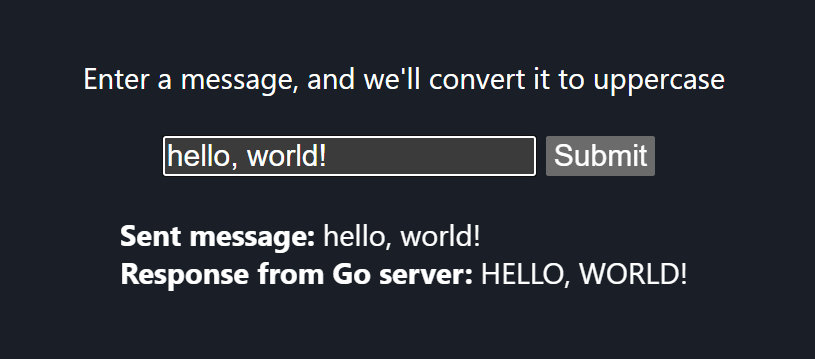

# Simple Go Server

## Overview

Goで実装された簡単なWebサーバーとReactを使ったフロントエンドのアプリケーション



## Setup

フロントエンドの依存関係をDockerコンテナを使用してインストール

```bash
docker run -it --rm -v "$PWD/frontend:/app" -w /app node:16-bullseye sh -c "npm install"
``````

## Run

1. Docker Composeでコンテナをビルド

    ```bash
    docker-compose -f docker-compose.yaml build
    ```

2. Docker Composeでコンテナを起動

    ```bash
    docker-compose -f docker-compose.yaml up
    ```

3. ブラウザで [http://localhost:3000](http://localhost:3000) にアクセス

## Memo

最初にReactのプロジェクトを作成する場合は以下のコマンドを実行<br>
my-appディレクトリの中身をfrontendディレクトリに移動する

```bash
docker run -it --rm -v "$PWD/frontend:/app" -w /app node:16-bullseye sh -c "npm install -g create-react-app && create-react-app my-app"
```
